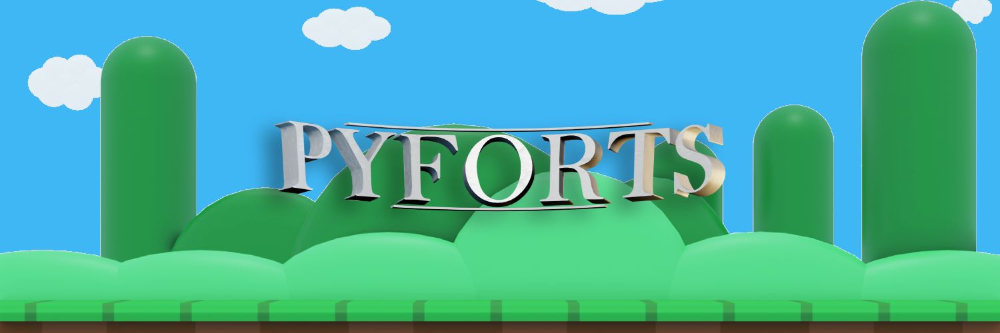

# PyForts

PyForts is a simplified version of the game [Forts](https://www.earthworkgames.com/forts/), made in Python.

It was made as part of our first year project ("projet transverse") at Efrei Paris, from February to May 2021.

This repository is a copy of the original, that was hosted on Azure Repos.

## Description

Construct the ultimate fort to shield your reactor core and deploy powerful weapons to take down your opponent's! PyForts is an exciting online multiplayer real-time strategy game where you manage resources to build, battle, and dominate. The game supports up to two players simultaneously, with additional slots for spectators to watch the action unfold in real-time.

## Key points

Physics are simulated on the client and server simultaneously, for fast and accurate renders on all clients.

PyForts supports modding with a built-in plug-in system. In fact, the base content is a mod itself that can be modified! Players can also join modded servers. Server owners can choose to prevent modded clients from joining, or require mods to be installed. You can find a mod template to create your own in the `/mods/mod_template/` folder.

## Code

The client code is located in `client.py`. The server code is located in `server.py`. Both files use the `game.py` file for the game logic.

The engine code can be found in the `/PyForts/` folder.

A wiki (in French) was also created during development to help our team follow the same principles and conventions. You can see it in the `/wiki/` folder.

## Trivia

At some point, the game would run very slowly. After some investigating, it was found that more than ten threads would be running simultaneously to handle the different menus, exchanges between the client and the server, rendering, physics processing, and so on. We managed to reduce that to only two threads by refactoring much of the code and introducing a state stack for the different menus in the game.

All the music and sounds were made by us! We released two short albums containing both. It was a bit pointless, yes, but really fun to make!

Guess what? The 3D models, images and videos were also made by us! We wanted PyForts to truly feel _unique_.

PyForts was supposed to have multiple environments, each with their own music, background image, gravity and air friction. We didn't have time to implement them, but you can still find the music for these maps in the `/assets/` folder!

---

Copyright (c) 2020-2021, Evan ZANZUCCHI, Hugo PANEL, Mohamed ZAMMIT CHATTI, Nathan MOREL, Victor BOULET
