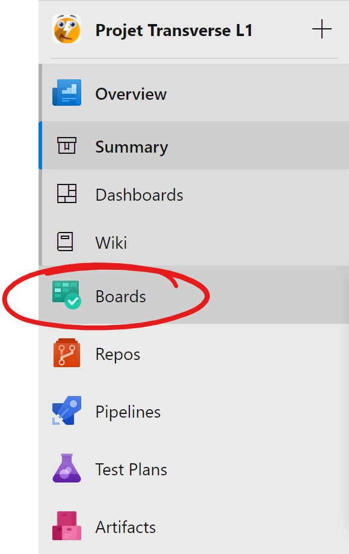
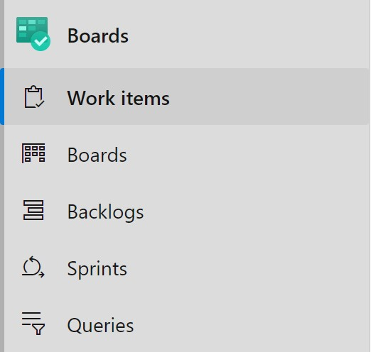
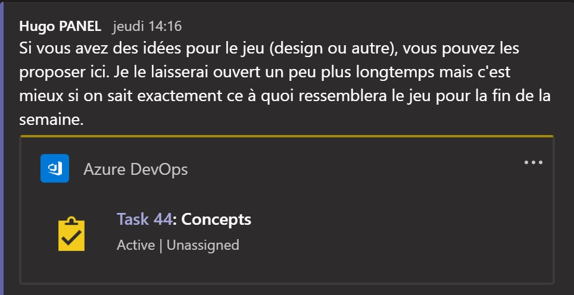
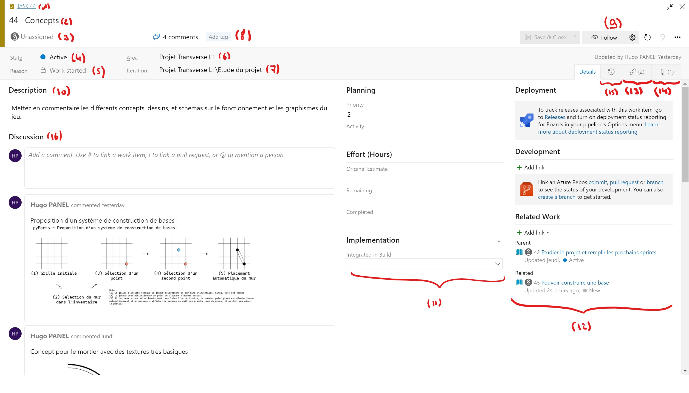
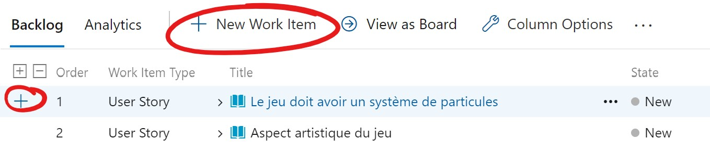
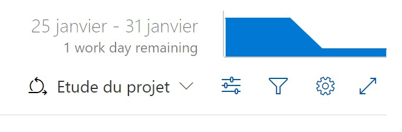
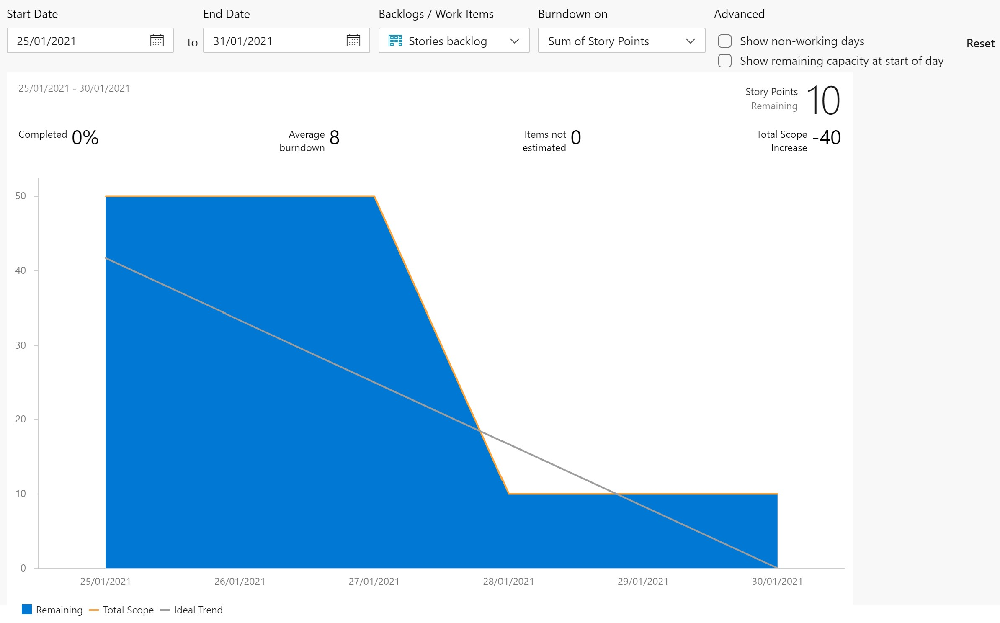

# Utiliser Azure Boards

## Introduction
Azure Boards et un outil de planification, de gestion et de suivi de projet.

Il nous permet d'utiliser différentes méthodes de travail. Pour ce projet, nous utilisons notre version de la méthode Agile.

Dans cette méthode, le travail est réparti en Work Items. Voici la structure dans l'ordre hiérarchique :
- Epic : Les Epics sont des concepts généraux. Par exemple : "Moteur de jeu", ou "Multijoueur".
- User Story : Les User Stories sont exprimés sous forme de requêtes. Elles représentent des propositions que les utilisateurs pourraient faire. Par exemple : "Il faudrait avoir un tutoriel pour apprendre à jouer".
- Feature : Les Features sont des fonctionnalités à ajouter. Par exemple : "Système multijoueur", "Client", "Serveur" ou plus précis, "Classe Particule", "Fonction Tirer".
- Work Item : Les Work Items représentent des tâches uniques à réaliser. Par exemple : "Implémenter le calcul de la trajectoire", "Créer le projectile", "Dessiner le réacteur". Au même niveau que les Work Items, on retrouve les Bugs (lorsqu'une fonctionnalité ne fonctionne pas comme prévu), Issue (lorsqu'un problème est rencontré, ce n'est pas forcément un bug), et Test Case (qui expliquent des procédures pour tester une fonctionnalité ou reproduire un bug).

Le travail est ensuite réparti sur des sprints. Les sprints représentent des périodes de développement qui, pour nous, durent une semaine. A la fin de chaque sprint, les tâches associées à celui-ci doivent être terminées. On fait une réunion à chaque début/fin de sprint pour faire le point sur l'avancement, et les problèmes rencontrés.

## En Pratique
Pour accéder à Azure Boards :
- Se rendre sur la page du projet (dev.azure.com > Projet Transverse L1)
- Sélectionner Boards :

On a ensuite le choix entre plusieurs pages :
- Work Items : pour voir toutes les tâches à effectuer.
- Boards : pour afficher chaque sprint sous forme de tableau Kanban.
- Backlogs : pour afficher toutes les tâches de manière hiérarchique (les Work Items seront dans des User Stories, etc.) et les assigner à des sprints.
- Sprints : pour voir les tâches à effectuer dans un sprint particulier.
- Queries : pour afficher et saisir des requêtes (ex: sélectionner les Work Items correspondant à un critère, etc.)

Note : les pages les plus utilisées sont Backlogs et Sprints.

## Accéder à un Work Item
On peut accéder à un Work Item de différentes manières. Si on sait à quel sprint il appartient, on peut utiliser la page Sprints. Ils peuvent aussi être référencés sur Teams :

Apparence d'un Work Item (les autre types comme User Story, Feature, Epic, etc. ont une structure similaire) :

Légende :
- (1): Type et identifiant. Affiche s'il s'agit d'un Work Item, User Story, Feature, Epic, etc. Chaque item a un identifiant qui permet d'y faire référence autre part.
- (2): Titre du Work Item.
- (3): Personne chargée de remplir la tâche.
- (4): Statut. Peut être "Actif", "Abandonné", "Fermé", etc.
- (5): Raison. Chaque statut a une description. Le Work Item peut être Fermé pour plusieurs raisons : la tâche est résolue, elle a été repousée, etc.
- (6): Nom du projet.
- (7): Nom du sprint.
- (8): Tags. Permet de mieux trier et caractériser les items.
- (9): Détermine si vous suivez l'item ou non. Si oui, vous pouvez choisir de recevoir des notifications lorsqu'une action en rapport avec cet item est effectuée.
- (10): Description de l'item.
- (11): Détails de l'item. Ici, la priorité, l'activité (développement, design, etc.), l'estimation du temps nécessaire, et la version du projet qui verra la fonctionnalité intégrée.
- (12): Items en rapport avec celui-ci.
- (13): Affiche les liens avec d'autres items. Similaire à (12) mais dans une fenêtre dédiée et avec plus de détails.
- (14): Pièces jointes à l'item. Par exemple, on pourrait avoir un dessin ou un schéma explicatif.
- (15): Timeline, permet d'afficher toutes les modifications apportées à l'item.
- (16): Commentaires. Pour envoyer son commentaire, il faut sauvegarder le ticket en haut de la fenêtre. On a la possibilité d'ajouter des réactions aux commentaires, pour dire par exemple si on est d'accord ou pas, etc.

N'hésitez pas à utiliser les commentaires lorsque vous rencontrez un problème, ou avancez bien.

Ne fermez pas les tickets tout de suite si vous n'avez pas encore soumis votre code et fait une Pull Request ! (Voir [Comment contribuer du code](./contribute.md) pour l'utilisation des PR).

## Créer un Item
Si vous découvrez que le travail ne peut pas etre effectué d'un coup avec un seul Work Item, ou que de nouvelles fonctionnalités doivent être ajoutées, vous pouvez créer vous même un item. 

Pour ce faire, rendez-vous sur la page Backlogs ou Sprints et appuyez soit sur Add Work Item pour ajouter un User Story / Epic / Feature, ou le '+' à côté du User Story pour y ajouter un enfant (Work Item).

## Visualiser l'avancement
Azure Boards peut générer des rapports et des graphiques.

Vous trouverez en haut à droite de la page Sprints un aperçu de la progression du travail sous forme de graphique pour le sprint actuel :

En cliquant dessus, vous aurez plus de détails et d'options :

