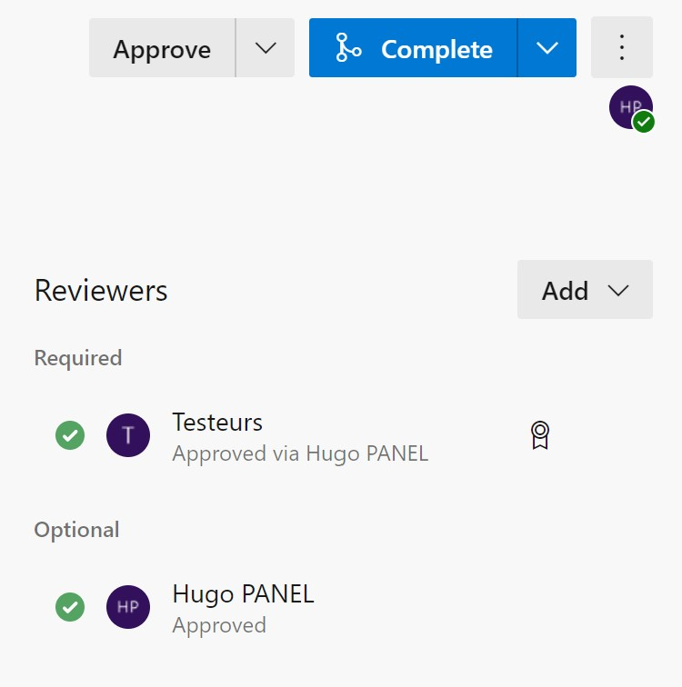

# Contribuer du code

## Introduction
Soumettre vos contributions est indispensable lors du développement du projet. Pour cela, vous devez maîtriser Git et connaître [Azure Repos](./repos.md).


## Git Commit et Push
Une fois vos modifications effectuées, vous devez les sauvegarder sur Git :
```bash
$ git add .
$ git commit
```
Pensez à mettre un message de commit explicite qui détaille son intérêt.
Exemple de commit :


Ensuite, (cette étape peut être effectuée avant le commit) créez et changez de branche :


Vous pouvez ensuite envoyer vos modifications sur le dépôt: 


## Création d'une Pull Request
Pour des raisons de sécurité et d'organiastion, les pushs sur la branche principale (main) sont désactivés.

Les Pull Requests (PR) permettent de soumettre du code à vérification avant de l'ajouter définitivement au projet. Les PR sont vérifiées par le groupe "Testeurs" puis approuvées ou rejetées.

Pour créer une Pull Request à partir d'une branche, allez sur la page **Repos > Pull Requets**.


Une fenêtre s'affiche ensuite.<br>
Commencez par renseigner l'opération (ici, un merge de la branche wiki vers la branche main). Renseignez ensuite un titre, une description (vous pouvez insérer automatiquement les messages des commits de la branche), et ajoutez le groupe "Testeurs" aux Required Reviewers (cette opération devrait se faire automatiquement).<br>
Vous pouvez ensuite renseigner les Work Items en lien avec cette PR (par exemple, ceux que vous avez résolu ou terminés).


*Note : les PR sont référencées dans les Work Items par leur identifiants précédés d'un point d'exclamation (ex: !1).*


## Approbation d'une Pull Request
Les Pull Requests devront être testées et approuvées par le groupe "Testeurs".<br>
Les Reviewers peuvent approuver une PR, la refuser, ou demander des modifications.<br>
Une section commentaire permet à tout le monde de discuter de la PR.


Des vérifiations automatiques sont effectuées et vous aurez des avertissements si : 
- Aucun Work Item n'est renseigné, autrement dit si la PR ne résoud aucune tâche;
- Les commentaires apportés par les Reviewers ne sont pas tous satisfaits.


## Compléter une Pull Request
Une fois la Pull Request approuvée, vous pouvez la compléter pour apporter vos modifications.


Pour finalement compléter la PR, sélectionnez les options de merge. Les paramètres par défaut (ceux indiqués ci-dessous) sont suffisants et fonctionnent dans la majorité des cas.<br>
Cliquez donc sur Complete Merge pour finaliser la PR.


Une fois la Pull Request complétée, le statut Completed lui sera attribué.
