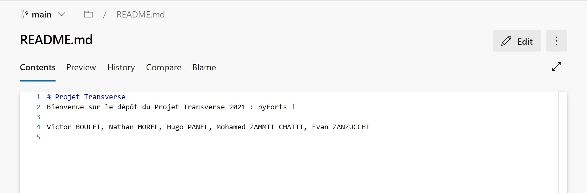

# Utiliser Azure Repos

## Introduction et accueil
Nous utilisons dans ce projet Azure Repos avec Git. Il faut donc maitriser Git d'abord.

Voici l'interface principale d'Azure Repos :

Légende:
- (1): Différentes pages disponibles.
- (2): Nom du dépôt Git actuel.
- (3): Liste des fichiers sur le dépôt (on trouve aussi une liste à droite).
- (4): Branche actuelle.
- (5): Donne un lien vers le dépôt pour le cloner sur son ordinateur.
- (6): Dépôt actuel.
Le bouton History permet de voir la liste des commits sur la branche actuelle. La fenêtre Commits (1) permet aussi d'afficher les commits, mais sur plusieurs branches.

## Informations sur un fichier

La bouton Contents permet d'afficher le contenu d'un fichier. Le bouton Preview (uniquement disponible pour les fichiers Markdown, *.md) affiche un aperçu du fichier. Le bouton History affiche un historique des différents commits modifiants ce fichier. Le bouton Compare permet de comparer différentes version du même fichier, dans différents commits. Le bouton Blame permet de voir la personne à l'origine de chaque modification apportée au fichier.

Le bouton Edit permet de modifier le fichier depuis Azure Repos. Il est déconseillé de l'utiliser sauf pour de petites modifications rapides.

## Pull Requests
Cette page permet d'afficher les Pull Requets du projet sur différents dépôts et différentes branches. Pour plus d'informations sur les Pull Requests (aussi appelées PR), voir [Comment contribuer du code](./contribute.md).